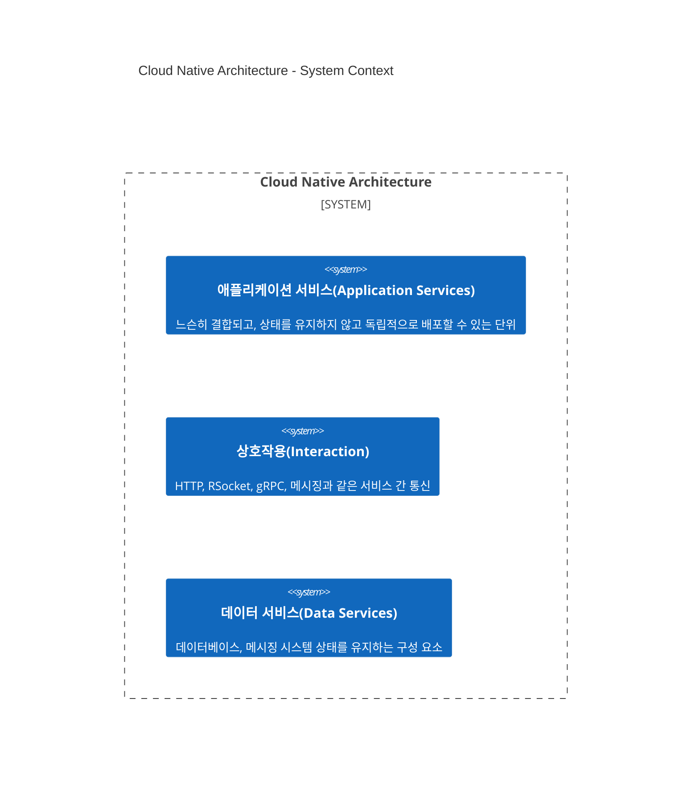
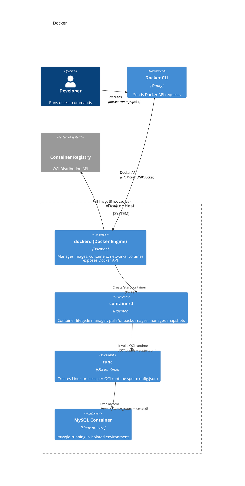
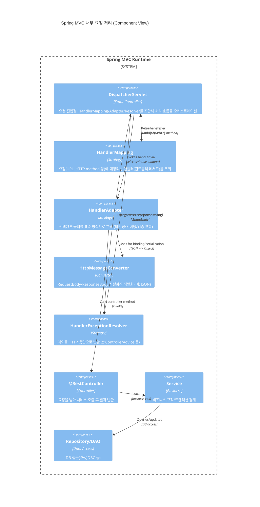
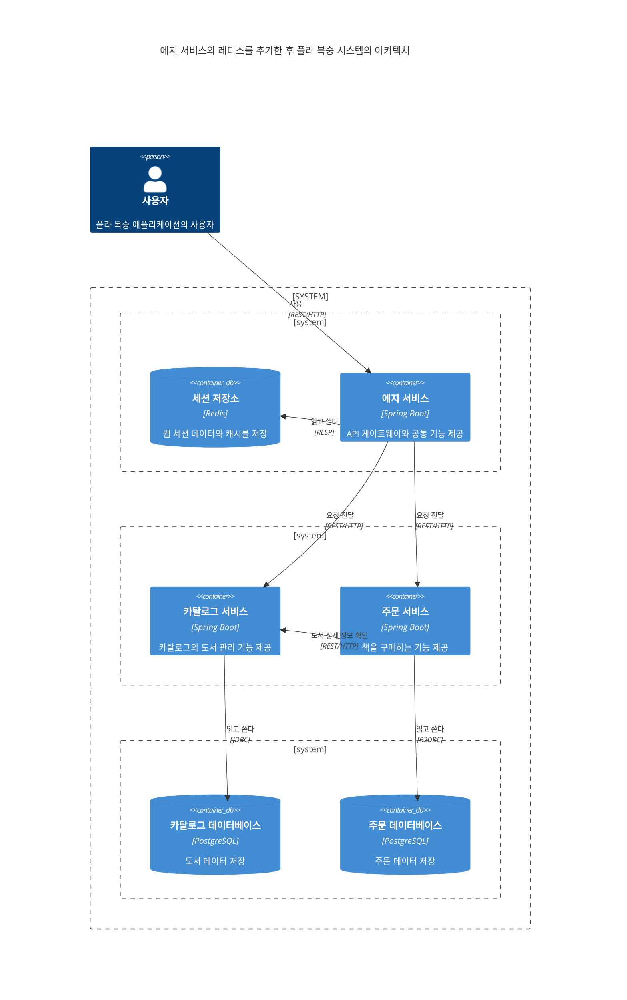
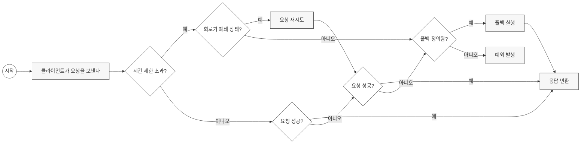

# 클라우드 네이티브 (Cloud Native)

개발자와 운영자 간의 협력이 가장 중요하다.

모두 함계 전체 제품 수명 주기에 대한 책임이 있으며 지속적 전달이라는 목표를 달성하기 위해 중요하다.

**Table of Contents**

<!-- TOC -->
- [클라우드 네이티브 (Cloud Native)](#클라우드-네이티브-cloud-native)
  - [CI (Continuous Integration)](#ci-continuous-integration)
  - [CD (Continuous Delivery)](#cd-continuous-delivery)
  - [컨테이너](#컨테이너)
  - [서버리스](#서버리스)
  - [15 요소 방법론 (15 Factor methodology)](#15-요소-방법론-15-factor-methodology)
    - [1. 하나의 코드베이스 하나의 애플리케이션](#1-하나의-코드베이스-하나의-애플리케이션)
    - [2. API 우선](#2-api-우선)
    - [3. 로그](#3-로그)
    - [4. 일회성](#4-일회성)
    - [5. 관리 프로세스(Administrative process)](#5-관리-프로세스administrative-process)
    - [6. 상태를 갖지 않는 프로세스(stateless process)](#6-상태를-갖지-않는-프로세스stateless-process)
    - [7. 원격 측정](#7-원격-측정)
    - [8. 인증 및 승인](#8-인증-및-승인)
  - [도커](#도커)
    - [계층화된 JAR 모드](#계층화된-jar-모드)
    - [buildpacks](#buildpacks)
    - [빌드 스크립트](#빌드-스크립트)
      - [CLI](#cli)
      - [docker compose](#docker-compose)
  - [쿠버네티스](#쿠버네티스)
    - [간단한 로컬에서 테스트](#간단한-로컬에서-테스트)
    - [서비스 검색(Service Discovery)](#서비스-검색service-discovery)
    - [일회성](#일회성)
    - [틸트](#틸트)
    - [kubeval](#kubeval)
      - [GitHub action](#github-action)
  - [Spring MVC](#spring-mvc)
  - [spring data jpa](#spring-data-jpa)
    - [connection pool](#connection-pool)
    - [낙관적 락](#낙관적-락)
  - [flyway](#flyway)
  - [architecture](#architecture)
<!-- TOC -->

---

## CI (Continuous Integration)

커밋이 있으면 소스는 자동으로 컴파일되고 테스트되며
실행 가능한 아티팩트(예: Jar, 컨테이너 이미지)로 패키징된다.

새로운 변경이 있을 때마다 소트프웨어 상태에 대한 피드백을 빨리 얻고자 하는 의도다.

오류가 감지되면 즉시 수정함으로써 기본 브랜치는 개발 작업을 문제없이 계속하기 위한 안정적인 토대가 되어야 한다.

## CD (Continuous Delivery)

CI를 기반으로 하며 **기본 브랜치가 문제없이 배포 가능한 상태를 유지**하도록 하는 데 중점을 둔다.

지속적 전달은 배포 파이프라인(deployment pipeline)을 통해 전체 프로세스의 자동화를 촉진한다.

이 과정에서 **배포 유효성**을 검증하기 위해 테스트, 통합 테스트, 보안 테스트, 컴플라이언스 테스트와 같은 여러 테스트를 거친다.

지속적 전달을 지속적 배포(continuous deployment)와 혼동하는 경우가 있다.

지속적 전달은 변경이 이루어진 후에 소프트웨어가 실제 서비스 환경에 배포될 수 있는 상태인지 확인을 필요로 한다.

배포 여부는 사업상의 결정이다. 반면 지속적 배포는 배포 파이프라인에 마지막 단계를 하나 추가하여 변경된 사항을 프로덕션에 자동으로 배포한다.

## 컨테이너

컨테이너 이전에는 환경 재추축, 격리 및 설정을 위해 가상 컴퓨터에 의존함.

- **네임스페이스**(namespace): 각 프로세스가 시스템에서 사용할 수 있는 리소스를 일부만 볼 수 있도록 하기 위해 프로세스 간 리소스를 분할
- **c그룹**(cgroup): 프로세스(또는 프로세스 그룹)에 대한 리소스 사용을 제어하고 제한

동일한 배포 환경을 보장할 수 있음. (arm, amd64 와 같은 환경이 달라짐: `docker multi stage build`)

## 서버리스

서버리스 아키텍처는 일반저긍로 함수와 관련 있지만 두 가지 모델로 나뉜다.

- **서비스형 백엔드**(backend as a service, BaaS): 백엔드 서비스의 개발 및 운영 비용을 줄이는 데 중점을 둔다.
  개발자는 백엔드 기능의 대부분 또는 전부를 BaaS 공급 업체에 일임하고 FE 애플리케이션을 구현할 수 있다. 예를 들어 옥타(Okta)를 사용해 사용자를 인증하는 경우가 있다.
- **서비스형 함수**(function as a service, FaaS): 상태가 없고 이벤트에 의해 실행되며 플랫폼이 전적으로 관리하는 애플리케이션을 의미한다.
  케이네이티브 및 아파치 오픈휘스크가 있다.



---

## 15 요소 방법론 (15 Factor methodology)

클라우드 네이티브 애플리케이션을 개발하기 좋은 출발점이다.

- 하나의 코드베이스, 하나의 애플리케이션
- API 우선
- 의존성 관리 (명시적인 방식으로 선언. 예: something-util:1.1.8)
- 설계, 빌드, 릴리스, 실행 (런타임에 코드를 변경하지 못함)
- 설정(configuration), credentials (환경 변수화)
- 로그
- 일회성
- 지원 서비스(backing services): 모놀리식을 분리하여 애플리케이션 서비스 + 데이터 서비스
- 환경 동일성(environment parity): time gap, people gap(운영 환경 버전들..?), tool gap(예: postgresSQL, H2 등등)
- 관리 프로세스
- 포트 바인딩
- 상태를 갖지 않는 프로세스(stateless process)
- 동시성
- 원격 측정
- 인증 및 승인

### 1. 하나의 코드베이스 하나의 애플리케이션

모노레포를 금지하자는 것이 아니다.
"독립 빌드/배포/런타임을 지키자"를 의미한다.

### 2. API 우선

클라우드 네이티브 시스템은 API를 통해 서로 통신하는 다양한 서비스로 이루어진다.

클라우드 네이티브 애플리케이션을 설계할 때 **API 우선**(API First) 접근 방식을 사용하면 분산 시스템에
적합하도록 시스템을 고려하고 서로 다른 팀 간의 업무를 배분할 수 있다.

API를 먼저 설계함으로써 해당 애플리케이션을 백엔드 서비스로 사용하는 다른 팀은 해당 API를 가지고 자신들의
시스템 개발을 진행할 수 있다.

코드 계약을 미리 설계하면 다른 시스템과의 통합은 더욱 견고해진다. 내부적으로는 다른 애플리케이션에 영향을 미치지 않고
API의 구현을 변경할 수도 있다.

### 3. 로그

클라우드 네이티브 애플리케이션은 로그의 라우팅 및 저장과는 관련이 없다.
애플리케이션은 로그를 시간 순서대로 생성되는 이벤트로 처리해 표준 출력에 기록한다.
로그 저장이나 순환에 대해서는 애플리케이션이 더 이상 신경 쓰지 말아햐 한다.
로그 수집기와 같은 외부 툴을 사용해 로그를 수집하고 검사할 수 있다.

### 4. 일회성

애플리케이션은 삭제될 수 있다. 실패가 발생하고 애플리케이션이 응답하지 않으면 종료하고 새 인스턴스를 시작하면 된다.
부하가 많아지면 증가된 워크로드를 지원하기 위해 애플리케이션 인스턴스를 늘리면 된다.

언제라도 애플리케이션을 시작하거나 중지할 수 있는 경우를 일컬어
'이 애플리케이션은 **일회성**(disposability)이다'라고 한다.

애플리케이션이 종료 신호를 받으면 새로운 요청을 수락하지 않고
이미 진행중인 요청을 모두 종료한 다음 종료하는 것을 **우아한 종료**(graceful shutdown)라고 한다.

우아한 종료가 “보장”되려면 아래가 충족돼야 합니다.

- SIGTERM 핸들링(또는 Spring 종료 훅) 구현
- 새 작업 수신 즉시 중단(리스너/폴링 중지)
- in-flight 작업 추적 및 드레인 대기
- ACK/commit은 완료 후에만
- 멱등성(중복 처리) 방어
- 처리 시간 한도 및 강제 종료 시 재시도 설계
- K8s terminationGracePeriodSeconds 정합

### 5. 관리 프로세스(Administrative process)

관리 작업 역시 코드의 형태로 형상 관리 시스템을 통해 관리하면서 지원의 대상이 되는 애플리케이션과
함께 제공해서 애플리케이션과 동일환 환경에서 실행해야 한다.

### 6. 상태를 갖지 않는 프로세스(stateless process)

상태를 갖지 않는 프로세스(stateless process)가 되도록 설계하고
**아무것도 공유하지 않는 아키텍처**(share-nothing architecture)를 채택해야 한다.

이는 애플리케이션 인스턴스 간에 상태를 공유해서는 안 된다는 의미다.

### 7. 원격 측정

관측 가능성은 클라우드 네이티브 애플리케이션 속성 중 하나다.

**원격 측정**(telemetry) 데이터의 예로는 로그, 메트릭, 추적, 상태, 이벤트가 있다.

### 8. 인증 및 승인

**제로 트러스트**(zero trust) 접근법에 따라 시스템 내 상호작용의 안정성은 모든 설계적,
인프라적 수준에서 확보되어야 한다.

---

## 도커

**[오픈 컨테이너 이니셔티브](https://opencontainers.org/)**(Open Container Initiative)는 컨테이너 작업을 위한 업계 표준을 정의한다.

OCI 이미지 사양은 컨테이너 이미지를 빌드하는 방법, OCI 런타임 사양은 컨테이너 이미지를 실행하는 방법을, OCI 배포 사양은 컨테이너 이미지를
배포하는 방법을 정의한다.

**OCI Image Spec**: 파일 포맷 인터페이스, 메타데이터 계약

- 이미지 Layout
- Layer 구조
- Manifest 형식
- 등등

**OCI Runtime Spec**: 실행 명세를 주면 런타임을 이를 기반으로 컨테이너 프로세스를 실행

- config.json(명세)
  - 프로세스(cmd, args, env)
  - root filesystem
  - Linux namespace
  - cgroups
  - mounts

클라이언트/서버 아키텍처를 특징으로 하는 도커 엔진 패키지를 갖게 된다.
**도커 서버**에는 **도커 데몬**이 포함되어 있는데 도커 데몬은 백그라운드에서 실행하면서 이미지, 컨테이너, 볼륨, 네트워크 같은 도커 객체를 만들고 관리한다.
도커 서버가 실행되는 컴퓨터를 **도커 호스트**(Docker host)라고 한다.

도커 데몬은 API를 제공하는 데 이 API를 통해 컨테이너를 실행하거나 볼륨을 생성하는 것과 같은 명령을 도커에 전달할 수 있다.
이 API를 사용하해 데몬과 상호작용하는 것이 **도커 클라이언트**다.

도커 클라이언트는 도커 컴포즈(Docker Compose)와 같이 스크립트 방식을 사용하거나 CLI를 사용해 도커 데몬과의 직접 상호작용 하면서
명령을 전달한다.



**컨테이너 이미지를 만들기 위해 도커파일에서 사용하는 일반적인 명령어**

| 명령         | 설명                                                                        | 예                                                  |
|------------|---------------------------------------------------------------------------|----------------------------------------------------|
| FROM       | 베이스 이미지. 도커파일에서 가장 처음에 와야 하는 명령어다.                                        | `FROM registry.access.redhat.com/ubi9/ubi-minimal` |
| LABEL      | 키-값 형식에 따라 이미지에 메타데이터를 추가한다.                                              | `LABEL version=1.1.3`                              |
| ARG        | 사용자가 빌드 시에 전달할 수 있는 변수를 정의한다. ARG 명령은 여러 번 정의할 수 있다.                      | `ARG VERSION=1.1.3`                                |
| RUN        | 기존 레이어 위에서 인자로 전달된 명령어를 실행해 새로운 레이어를 생성한다.                                | `RUN dnf update`                                   |
| COPY       | 호스트 파일이나 디렉토리를 컨테이너 이미지로 복사한다.                                            | `COPY ./app /app`                                  |
| USER       | 컨테이너 실행 시 사용할 사용자(및 그룹)를 설정한다. 보안을 위해 root가 아닌 사용자로 실행하는 것이 권장된다.         | `USER appuser`                                     |
| ENTRYPOINT | 컨테이너가 실행될 때 항상 실행되는 기본 명령어를 설정한다. CMD와 함께 사용될 경우 CMD는 ENTRYPOINT의 인자가 된다. | `ENTRYPOINT ["java", "-jar", "app.jar"]`           |
| CMD        | 컨테이너 실행 시 기본 명령어 또는 ENTRYPOINT의 기본 인자를 설정한다. docker run 시 덮어쓸 수 있다.       | `CMD ["--spring.profiles.active=prod"]`            |

### 계층화된 JAR 모드

컨테이너 이미지와 유사하게 여러 레이어로 만들어진다.
기본적으로 스프링 부트 애플리케이션은 다음과 같은 계층으로 이루어진 JAR 아티팩트로 패키징되는데
가장 낮은 계층부터 시작된다.

- **의존성 계층**: 프로젝트에 추가된 모든 주요 의존성
- **스프링 부트 로더(spring boot loader) 계층**: 스프링 부트 로더 컴포넌트가 사용하는 클래스
- **스냅샷 의존성(snapshot dependencies) 계층**: 모든 스냅샷 의존성
- **애플리케이션 계층**: 애플리케이션 클래스 및 리소스

```Dockerfile
FROM eclipse-temurin:25 AS builder
WORKDIR workspace
ARG JAR_FILE=build/libs/*.jar
COPY ${JAR_FILE} app.jar
RUN java -Djarmode=layertools -jar \
    app.jar extract

FROM eclipse-temurin:25-jre

RUN useradd spring
USER spring

WORKDIR workspace
COPY --from=builder workspace/dependencies/ ./
COPY --from=builder workspace/snapshot-dependencies/ ./
COPY --from=builder workspace/spring-boot-loader/ ./
COPY --from=builder workspace/application/ ./

ENTRYPOINT ["java", "org.springframework.boot.loader.JarLauncher"]
```

```bash
grype $ContainerName
```

### buildpacks

클라우드 네이티브 빌드팩이 제공하는 기능은 다음과 같다.

- 애플리케이션 유형을 자동으로 감지해 도커파일 없이 패키지를 생성한다.
- 다양한 언어와 플랫폼을 지원한다.
- 캐시와 레이어를 통해 높은 성능을 갖는다.
- 재현 가능한 빌드를 보장한다.
- 보안 측면에서 모범 사례를 사용한다.
- 프로덕션 환경에 적합한 이미지를 만든다.
- 그랄VM을 사용해 네이티브 이미지 빌드를 지원한다.

### 빌드 스크립트

```kotlin
bootBuildImage {
  imageName = "${project.name}:${project.version}"
  environment = listOf("BP_JVM_VERSION" to "25.*")

  docker {
    publishRegistry {
      username = project.findProperty("registryUserName")
      password = project.findProperty("registryPassword")
      url = project.findProperty("registryUrl")
    }
  }
}
```

#### CLI

```bash
./gradlew bootBuildImage \
  --imageName gchr.io/<your_github_username>/hello-service:0.0.1-SNAPSHOT \
  --publishImage \
  -PregistryUrl=gchr.io \
  -PregistryUserName=<your_github_username> \
  -PregistryPassword=<your_github_token>
```

#### docker compose

```yaml
services:
  hello-service:
    ports:
      - 9001:9001
      - 8001:8001
    environment:
      - BPL_JVM_THREAD_COUNT=50
      - SPRING_PROFILES_ACTIVE=local
      - BPL_DEBUG_ENABLED=true
      - BPL_DEBUG_PORT=8001 # Intellij remote debug port
```

---

## 쿠버네티스

도커로는 컨테이너를 개별 머신에 배포하지만 쿠버네티스로는 컨테이너를 여러 머신으로
이루어진 클러스터에 배포함으로써 확장성과 복원력을 가질 수 있다.

### 간단한 로컬에서 테스트

```bash
kubectl create deployment hello-service \
  --image=hello-service:0.0.1-SNAPSHOT

kubectl expose deployment hello-service \
  --name=hello-service \
  --port=8080

kubectl port-forward service/hello-service 8080:8080
```

### 서비스 검색(Service Discovery)

서비스 검색은 클라이언트 측 과 서버 측 패턴으로 구분된다.

클라이언트 측 서비스 검색을 위해서는 애플리케이션이 시작할 때 서비스 레지스트리에 등록하고 종료할 때 등록을 취소해야 한다.
다른 서비스를 호출하는 경우 레지스트리에 IP 주소를 요청한다.
서비스 디스커버리를 관리하는 주체에 IP 주소 목록을 가져와서 애플리케이션에서 로드 밸런싱까지 해야 한다.

쿠버네티스에서는 서버 측에서 관리하는 방법을 채택하였다.

서비스 객체는 파드 집합을 대상으로 한다.

서비스 이름의 IP 주소를 찾으면, 쿠버네티스 프록시(kube proxy)를 사용해 서비스 객체에 대한 연결을 가로채 서비스 대상 파드 중 하나로 전달한다.
프록시는 현재 가용한 모든 복제본을 알고 있으며 서비스 유형 및 프록시 설정에 따라 부하 분산 전략을 채택한다.

### 일회성

일회성을 위한 조건 빠른 시작과 우아한 종료다.

- **빠른 시작**: 스프링 네이티브 및 그랄VM을 사용해 네이티브 이미지로 패키징
- **우아한 종료**: 우아한 종료 기간은 기본 30초로 설정되어 있고, `spring.lifecycle.timeout-per-shutdown-phase` 속성을 통해 변경 가능하다.

```yaml
server:
  shutdown: graceful

spring:
  lifecycle:
    timeout-per-shutdown-phase: 10s
```

```yaml
spec:
  template:
    spec:
      lifecycle:
        preStop:
          exec:
            command: [ "sh", "-c", "sleep 5" ]
      terminationGracePeriodSeconds: 10
```

### [틸트](https://github.com/tilt-dev/tilt)

틸트는 **틸트파일**(Tiltfile)이라는 확장 가능한 설정 파일을 통해 설정할 수 있다.
이 파일은 스타라크(Starlark: 파이썬을 단순화한 프로그래밍 언어)라는 언어로 작성한다.
이 파일은 세 가지 주요 설정을 담고 있다.

- 컨테이너 이미지를 빌드하는 방법(cloud native buildpacks)
- 애플리케이션을 배포하는 방법(쿠버네티스 yaml manifest)
- 애플리케이션에 액세스 하는 방법(포트 전달)

```python
# 빌드
custom_build(
  # 컨테이너 이미지의 이름
  ref = "catalog-service",
  # 컨테이너 이미지를 빌드하기 위한 명령
  command = "./gradlew bootBuildImage --imageName $EXPECTED_REF",
  # 새로운 빌드를 시작하기 위해 지켜봐야 하는 파일
  deps = ["build.gradle", "src"]
)

# 배포
k8s_yaml(["k8s/deployment.yaml", "k8s/service.yaml"])

# 관리
k8s_resource("catalog-service", port_forwards=["9001"])
```

```bash
tilt up
```

### [kubeval](https://github.com/instrumenta/kubeval)

```bash
kubeval --strict -d k8s
```

#### GitHub action

```yaml
jobs:
  build:
    steps:
      - name: Validate Kubernetes manifests
        uses: stefanprodan/kube-tools@v1
        with:
          kubectl: 1.32.7
          kubeval: 0.16.1
          command: kubeval --strict -d k8s
```

## Spring MVC

```text
Client
  ↓
Tomcat Connector (platform thread)
  ↓
[ Worker Thread (OS / Platform Thread) ]
  ↓
DispatcherServlet
  ↓
HandlerMapping → HandlerAdapter → @RestController
  ↓
Service / Repository / JDBC
  ↓
Response

---

spring:
  threads:
    virtual:
      enabled: true

Client
  ↓
Tomcat Connector (platform thread): 요청을 처리할 준비가 됐는지 확인하는 스레드
  ↓
Tomcat Poller / Selector (platform thread): 요청을 처리할 준비가 됐는지 확인하는 스레드
  ↓
[ Executor ]
  └─ submit() → Virtual Thread 생성
        ↓
     DispatcherServlet
        ↓
     HandlerMapping → HandlerAdapter → @RestController
        ↓
     Service / Repository / JDBC
        ↓
     Response
```



---

## spring data jpa

```bash
docker run -d \
  --name postgres \
  -e POSTGRES_USER= user \
  -e POSTGRES_PASSWORD= password \
  -e POSTGRES_DB= db \
  -p 5432:5432 \
  postgres:17
```

```yaml
spring:
  datasource:
    username: user
    password: password
    url: jdbc:postgresql://localhost:5432/db
```

### connection pool

히카리CP(Hikari CP)는 최소한 두 가지 설정이 필요하다.

- 연결 타임아웃 (`spring.datasource.hikri.connection-timeout`)
- 최대 풀 크기(`spring.datasource.hikari.maximum-pool-size`)

해당 두 가지 설정이 필요한 이유는 애플리케이션의 복원력과 성능에 영향을 미치기 때문이다.

### 낙관적 락

```java
// Read 객체
public record Book(
    @Nullable @Id Long id,
    @Version int version // OptimisticLockException
  ) {
  public Book() {
    this(null, 0);
  }
}
```

## flyway

`src/main/resources/db/migration`

이 폴더는 기본 설정에 따라 플라이웨이가 SQL 마이그레이션을 찾는 경로다.

- `V1__Initial_Schema.sql`: 버전 번호(V1) 뒤에 두 개의 밑줄이 있음을 유의
  - 접두사: 버전 마이그레이션은 V를 사용
  - 버전: 점이나 밑줄을 통해 여러 부분으로 구분되는 버전 번호(예: 2.1.3)
  - 구분자: 두 개의 밑줄(__)
  - 설명: 밑줄로 구분되는 하나 이상의 단어
  - 접미사: `.sql`

## architecture




