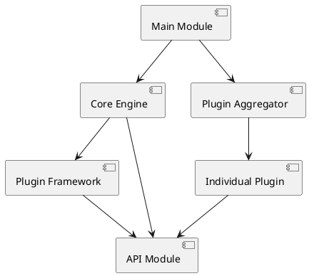

# 플러그인 가능한 모듈 구조 설계

이 문서는 OpenSearch Data Prepper의 사례를 바탕으로,
확장성이 뛰어난 '플러그인 방식(Plugin-based)' 애플리케이션을 구축할 때 필요한 모듈 구조와 설계 원칙을 정리한다.

---

## 핵심 설계 원칙: 의존성 역전 (DIP)

플러그인 아키텍처의 가장 큰 목표는 **"엔진(Core)은 구현체(Plugin)를 모르고, 오직 규약(API)만 알아야 한다"** 이다.

- **추상화 의존:** 상위 레벨의 엔진과 하위 레벨의 플러그인이 모두 추상화된 인터페이스(API)에 의존하도록 설계한다.
- **결합도 감소:** 엔진 코드를 수정하지 않고도 새로운 기능을 추가하거나 기존 기능을 교체할 수 있어야 한다. (Open-Closed Principle)

---

## 표준 모듈 계층 구조

플러그인 기반 시스템은 보통 다음과 같은 5가지 계층으로 나뉩니다.

### API 모듈 (The Contract)

- **역할:** 시스템 전체에서 사용하는 공통 인터페이스와 데이터 모델을 정의한다.
- **특징:** 의존성이 가장 낮아야 하며(최하위), 다른 모든 모듈이 이 모듈을 참조한다.
- **구성 요소:** `Source`, `Sink`, `Processor` 등의 인터페이스, `Event`, `Record` 등의 데이터 형식.

### 플러그인 프레임워크 (The Infrastructure)

- **역할:** 플러그인을 발견(Discovery)하고, 로딩하며, 의존성을 주입(DI)하는 인프라를 제공합니다.
- **특징:** 플러그인 간의 격리(Isolation)를 보장하고, 각 플러그인이 독립적인 실행 환경(Context)을 갖도록 관리합니다.

### 코어 엔진 (The Orchestrator)

- **역할:** 시스템의 핵심 비즈니스 로직과 워크플로우를 담당합니다.
- **특징:** API 인터페이스를 사용하여 플러그인들을 조립하고 실행

- **역할:** API 인터페이스를 실제로 구현하는 개별 모듈들입니다.
- **특징:** `api` 모듈만 의존하며, `core` 모듈의 내부 구현에는 접근할 수 없도록 격리됩니다. 각 플러그인은 독립적인 라이브러리 의존성을 가질 수 있습니다.

### 메인 모듈 (The Assembler)

- **역할:** 애플리케이션의 진입점(Main)이며, 엔진과 필요한 플러그인들을 모두 모아 실행 가능한 패키지로 구성합니다.
- **특징:** 설정(YAML 등)을 읽어 어떤 플러그인을 사용할지 결정하고 시스템을 기동합니다.

---

## 의존성 흐름도 (Dependency Flow)

- **상향 참조 금지:** 하위 모듈(API, Plugin)이 상위 모듈(Core, Main)을 직접 참조해서는 안 됩니다.
- **중앙 집중:** 모든 길은 `API` 모듈로 통하며, 인터페이스를 통해서만 상호작용합니다.

---

## 4. 플러그인 격리 전략 (Isolation Strategy)

성공적인 플러그인 아키텍처를 위해서는 플러그인 간의 간섭을 막는 것이 필수적입니다.

1. **Spring Context 격리:** 각 플러그인 인스턴스마다 독립적인 Bean 컨테이너를 생성하여 동일한 이름의 Bean 충돌을 방지합니다.
2. **클래스 로더 격리 (선택 사항):** 서로 다른 플러그인이 같은 라이브러리의 다른 버전을 사용해야 할 경우,
   각 플러그인마다 별도의 ClassLoader를 사용하여 충돌을 방지합니다.
3. **리소스 제한:** 각 플러그인이 사용하는 메모리나 CPU 타임을 모니터링하고 제한할 수 있는 구조를 갖춥니다.

---

## 5. 설계 체크리스트

- [ ] 새로운 플러그인을 추가할 때 `core` 모듈의 코드를 수정해야 하는가? (그렇다면 설계 오류)
- [ ] 특정 플러그인의 라이브러리 업데이트가 다른 플러그인에 영향을 주는가? (영향을 준다면 격리 부족)
- [ ] 엔진이 플러그인의 구체 클래스(Concrete Class) 이름을 코드 내에 직접 가지고 있는가? (그렇다면 API 추상화 부족)
- [ ] 플러그인 개발자가 엔진의 내부 로직을 직접 호출할 수 있는가? (그렇다면 캡슐화 위반)
