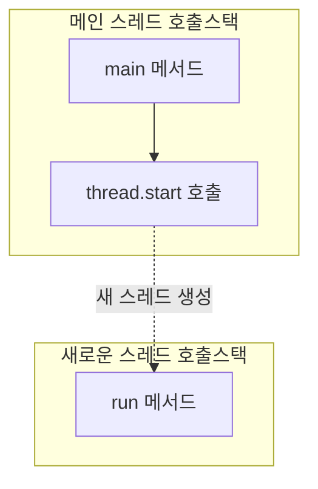
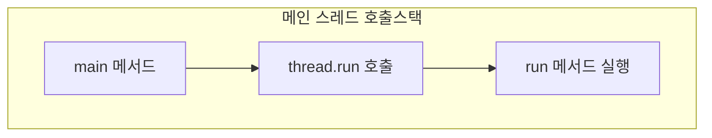

# Virtual Thread

## Program vs. Process

- pro: 앞으로
- gram: 텍스트 (명령어, 데이터)
- cess: 진행 (go)
- 프로그램은 '실행 가능한 파일 (HDD, SSD)'
- 프로세스는 '실행 중인 프로그램 (메모리)'

## Process와 쓰레드

- 프로세스는 '실행 중인 프로그램 (메모리)'
- 쓰레드는 '프로세스 내에서 **실행되는 단위**'
- OS 쓰레드의 생성 비용이 프로세스의 생성비용 보다 적다.

## start() vs. run()

### start() 호출 시



- `start()` 호출 시 새로운 호출스택이 생성되어 병렬로 실행
- 메인 스레드와 새 스레드가 독립적으로 동작

### run() 직접 호출 시



- `run()` 직접 호출 시 새로운 스레드가 생성되지 않음
- 메인 스레드의 호출스택에서 일반 메서드처럼 순차적으로 실행

## Blocking/Non-Blocking vs. Sync/Async

### Blocking vs. Non-Blocking (제어권의 관점)

- **누가 제어권을 가지고 있는가?**
- **Blocking**: 호출된 함수가 자신의 작업을 모두 마칠 때까지 호출한 함수에게 제어권을 넘겨주지 않고 대기하게 만듦. (프로세스/스레드 상태 관점)
- **Non-Blocking**: 호출된 함수가 작업 완료 여부와 상관없이 즉시 제어권을 호출한 함수에게 반환하여, 호출한 함수가 다른 일을 할 수 있게 함.

### Sync vs. Async (순서와 결과 처리의 관점)

- **작업의 순서와 완료 통지를 누가 관리하는가?**
- **Synchronous (동기)**: 호출한 함수가 호출된 함수의 작업 완료를 직접 기다리거나, 주기적으로 체크함. (작업의 흐름 관점)
- **Asynchronous (비동기)**: 호출된 함수에게 작업 완료 시 수행할 Task(콜백 등)를 위임하며, 호출한 함수는 완료 여부를 신경 쓰지 않고 자기 일을 계속함.

### 요약

| 구분                        | 관점                         | 핵심 키워드                    |
| :-------------------------- | :--------------------------- | :----------------------------- |
| **Blocking / Non-Blocking** | **제어권** (Control)         | 즉시 리턴 여부, 대기 상태      |
| **Sync / Async**            | **동기화** (Synchronization) | 작업 완료 여부 확인 주체, 순서 |

- 일반적으로 **Blocking/Non-Blocking**은 호출된 작업이 호출한 쪽을 **"멈추게 하느냐"**는 프로세스/스레드의 상태에 집중합니다.
- **Sync/Async**는 호출된 작업의 **"결과를 누가 처리하느냐"**는 작업 흐름과 비즈니스 로직의 완료 통지 방식에 집중합니다.

## 면접용 1분 요약 (핵심 차이점)

면접에서 "동기/비동기, 블러킹/넌블러킹의 차이를 설명해보세요"라는 질문을 받았을 때의 핵심 답변입니다.

### 1. Sync vs. Async (결과 처리의 관점)

> **핵심: "누가 결과를 챙기는가?"**

- **동기(Sync)**: 호출한 쪽이 작업의 완료를 **직접 챙깁니다.** (기다리거나, 계속 물어보거나)
- **비동기(Async)**: 호출된 쪽이 작업이 끝나면 알림을 주거나 콜백을 실행합니다. 호출한 쪽은 **신경 쓰지 않습니다.**

### 2. Blocking vs. Non-Blocking (제어권의 관점)

> **핵심: "호출된 함수가 바로 리턴하는가?"**

- **블러킹(Blocking)**: 호출된 함수가 자신의 작업을 마칠 때까지 제어권을 넘겨주지 않아, 호출한 쪽은 **아무것도 못 하고 멈춰있습니다.**
- **넌블러킹(Non-Blocking)**: 호출된 함수가 제어권을 즉시 반환하여, 호출한 쪽이 **다른 작업을 할 수 있게 해줍니다.**

### 3. 한 문장 핵심 비교

- **블러킹/넌블러킹**은 나의 **'상태'**(내가 지금 멈춰있는가?)에 집중합니다.
- **동기/비동기**는 작업 완료에 대한 **'관심사'**(결과를 누가 확인하는가?)에 집중합니다.

## 데몬 스레드(Daemon Thread) vs. 백그라운드 스레드(Background Thread)

많은 경우 혼용해서 사용하지만, 각각이 강조하는 핵심 개념과 동작 방식에 차이가 있습니다.

### 1. 데몬 스레드 (Daemon Thread)

- **핵심 개념**: 주 스레드(Main Thread/User Thread)의 작업을 돕는 **보조적인 역할을 수행하는 스레드**입니다.
- **동작 특징**: **주 스레드가 종료되면 데몬 스레드의 작업 완료 여부와 상관없이 함께 강제 종료**됩니다.
- **예시**: 자바의 가비지 컬렉터(GC), 자동 저장 기능, 화면 갱신 등.
- **용도**: 프로그램이 종료될 때 같이 종료되어야 하는 보조 작업에 주로 사용됩니다.

### 2. 백그라운드 스레드 (Background Thread)

- **핵심 개념**: 사용자에게 직접적으로 보이지 않는 곳에서 **비동기적으로 실행되는 작업**을 통칭합니다.
- **동작 특징**: 단순히 '뒤에서 도는 작업'을 의미하며, **주 스레드가 종료되어도 작업이 끝날 때까지 계속 실행될 수 있는 경우(User Thread)**가 많습니다.
- **예시**: 대용량 파일 다운로드, 네트워크 통신, 복잡한 연산 등.
- **용도**: 메인 UI나 주요 로직이 멈추지 않도록(Non-blocking) 무거운 작업을 분리할 때 사용됩니다.

### 3. 한눈에 보는 차이점

| 구분          | 데몬 스레드 (Daemon)                 | 백그라운드 스레드 (Background)                                         |
| :------------ | :----------------------------------- | :--------------------------------------------------------------------- |
| **핵심 성격** | 보조 및 관리용                       | 병렬 작업 및 비동기 처리                                               |
| **종료 조건** | **주 스레드 종료 시 함께 강제 종료** | 주 스레드 종료와 상관없이 완료될 때까지 실행 가능 (일반 스레드인 경우) |
| **사용 예시** | GC, 자동 저장, 맞춤법 검사           | 파일 업로드, DB 쿼리 처리, 데이터 분석                                 |

> **💡 요약**
> "백그라운드 스레드"는 **사용자 눈에 안 보이게 실행되는 모든 것**을 포괄하는 넓은 의미의 용어라면, "데몬 스레드"는 그중에서도 **'주 스레드와 생명주기를 같이하는 보조 스레드'**라는 구체적인 기술적 설정이 들어간 개념입니다.

## 스레드의 실행 제어

- `Thread.sleep()`: 본인 스레드
- `Thread.yield()`: 본인 스레드
- `join()`: 다른 스레드가 종료될 때까지 대기
- `interrupt()`: 대기 상태(WAITING)인 스레드를 실행 대기(RUNNABLE)로 만듬

### 스레드의 상태

| 상태            | 설명                                                                        |
| :-------------- | :-------------------------------------------------------------------------- |
| `NEW`           | 스레드가 생성되었지만 아직 `start()` 메서드가 호출되지 않은 상태            |
| `RUNNABLE`      | 스레드가 실행 가능한 상태 (CPU에 할당될 수 있는 상태)                       |
| `BLOCKED`       | 스레드가 락을 기다리는 상태 (동기화 블록 내에서 다른 스레드가 락을 보유 중) |
| `WAITING`       | 스레드가 특정 조건을 만족할 때까지 대기 중 (Object.wait() 등)               |
| `TIMED_WAITING` | 스레드가 특정 시간 동안 대기 중 (Thread.sleep(), Object.wait(long) 등)      |
| `TERMINATED`    | 스레드가 종료된 상태 (run() 메서드가 종료됨)                                |

## InterruptedException 처리 방법

자바에서 `sleep()`, `wait()`, `join()` 등 대기 상태에 들어가는 메서드들은 `InterruptedException`을 던집니다. 이는 외부에서 `interrupt()`를 호출하여 작업을 중단하라는 신호를 보냈음을 의미합니다.

### 1. Java에서의 처리 (Best Practices)

단순히 예외를 무시(`catch` 블록을 비워둠)하는 것은 가장 피해야 할 습관입니다.

#### A. 다시 인터럽트 발생시키기 (Re-interrupt)

가장 권장되는 방법입니다.

#### **핵심 메커니즘: 왜 상태가 false로 변하나요?**

일반적으로 `thread.interrupt()`를 호출하면 해당 스레드의 인터럽트 상태는 `true`가 됩니다.
하지만 **`sleep()`, `wait()`, `join()`과 같은 대기 상태 메서드**들은 실행 중 인터럽트를 받으면 다음 두 가지 일을 동시에 수행합니다:

1.  `InterruptedException`을 발생시킵니다.
2.  **스레드의 인터럽트 상태를 다시 `false`로 초기화합니다.**

이 설계의 이유는 **"예외 처리를 통해 인터럽트 신호가 전달되었으므로, 해당 신호를 소모(Consume)했다"** 고 간주하기 때문입니다.
JVM은 인터럽트가 발생했다는 사실을 예외라는 형태로 프로그래머에게 확실히 알렸으니, 상태 플래그는 깨끗하게 비워서 다음 동작에 지장이 없도록 하는 것입니다.

만약 `catch` 블록에서 아무것도 하지 않으면, 상위 호출 스택이나 스레드 풀(ExecutorService) 등은 이 스레드가 인터럽트되었다는 사실을 알 수 없게 됩니다.

**왜 다시 설정해야 하나요?**

- **상태 복구**: 예외를 잡는 것은 "내가 이 신호를 인지했다"는 뜻입니다. 하지만 내가 이 작업을 완전히 끝내는 주체가 아니라면, 나를 호출한 상위 메서드에게 "인터럽트가 발생했었다"는 사실을 알려야 합니다.
- **프레임워크와의 협업**: 스레드 풀이나 다른 동기화 라이브러리들은 스레드의 `isInterrupted()` 상태를 보고 작업 중단 여부를 결정하는 경우가 많습니다. 플래그를 다시 세우지 않으면 시스템이 멈추지 않고 계속 돌아가는 버그가 생길 수 있습니다.

```java
try {
    Thread.sleep(1000);
} catch (InterruptedException e) {
    // 1. 인터럽트 상태를 다시 true로 설정 (플래그 복구)
    Thread.currentThread().interrupt();

    // 2. 추가적인 정리 작업이나 루프 종료 등 수행
    log.info("인터럽트 발생, 작업을 중단합니다.");
    return; // 또는 break;
}
```

## 동기화

객체에 락을 걸어서 한번에 하나의 스레드만 접근하게 함

- wait() & notify(), notifyAll()

```java
class Account {
    private int balance;

    synchronized void withdraw(int amount) {
        while (balance < amount) {
            try {
                wait(); // 락(Lock)을 풀고 대기. Noticy를 받으면 락을 재획득
            } catch (InterruptedException e) {
                Thread.currentThread().interrupt();
                throw new RuntimeException("예기치 않은 인터럽트 발생", e);
            }

            balance -= amount;
        }
    }

    synchronized void deposit(int amount) {
        balance += amount;
        notify(); // 대기중인 스레드 중 하나에게 알림
        notifyAll(); // 대기중인 모든 스레드에게 알림
    }
}
```
