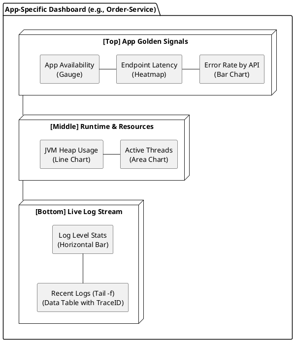

# 애플리케이션 중심 대시보드 및 로그 스트림 구성 가이드

본 문서는 개별 마이크로서비스 또는 애플리케이션 관점에서 심층 분석(Deep Dive)을 수행하기 위한 대시보드 구성과 실시간 로그 스트림(Log Streaming) 시각화 방안을 정의한다.

## 1. 대시보드 설계 목적

- **애플리케이션 컨텍스트 집중:** 특정 서비스의 성능 저하나 에러 발생 시, 해당 서비스와 관련된 모든 시그널(Logs, Traces, Metrics)을 한곳에서 파악한다.
- **실시간 로그 관측:** 터미널의 `tail -f`와 유사한 경험을 대시보드 내에서 제공하여 배포 직후나 장애 발생 시 로그 흐름을 즉각 확인한다.
- **상관관계 분석:** 특정 시점의 메트릭 변화와 로그 패턴의 연관성을 동일한 타임라인 상에서 분석한다.

---

## 2. 애플리케이션 관점의 지표 (App-Specific Metrics)

전역 RED Metrics를 해당 서비스로 필터링(`service.name: "my-app"`)하여 상세화한다.

| 지표 분류      | 상세 항목                          | 권장 시각화                | 용도                               |
| :------------- | :--------------------------------- | :------------------------- | :--------------------------------- |
| **App RED**    | 서비스별 RPS, 에러율, P99 지연시간 | **Area / Gauge / Line**    | 해당 앱의 골든 시그널 모니터링     |
| **Runtime**    | JVM Heap, GC Count, Thread Count   | **Line Chart / Stat**      | 런타임 환경의 안정성 확인          |
| **Log Stream** | 실시간 로그 메시지 및 레벨 분포    | **Data Table / Bar Chart** | 장애 로그 실시간 감지 및 흐름 파악 |

---

## 3. 로그 스트림(Log Streaming) 구성 방안

OpenSearch Dashboards의 `Discover` 기능을 위젯으로 임베딩하거나 `Data Table`을 활용하여 스트림 형태를 구현한다.

### 구성 요소

1. **Log Level Distribution (Bar Chart):** 최근 15분간의 `INFO`, `WARN`, `ERROR` 로그 발생 빈도를 실시간으로 표시.
2. **Live Log Table (Data Table):** `@timestamp`, `log.level`, `message`, `trace.id` 필드를 포함한 테이블.
    - **정렬:** `@timestamp` 기준 내림차순(최신순).
    - **자동 갱신:** 5~10초 주기로 설정하여 스트리밍 효과 구현.
3. **Trace ID Linkage:** 로그 내의 `trace.id`를 클릭하면 해당 트레이스의 상세 스팬(Span)으로 바로 이동할 수 있도록 구성.

---

## 4. 애플리케이션 중심 대시보드 레이아웃

### 시각적 레이아웃 (Layout Design)



### ASCII 레이아웃

```text
+-----------------------------------------------------------------------+
| [Top] App Golden Signals (Service: {app_name})                        |
| +-----------------+ +-------------------------+ +-------------------+ |
| | Availability %  | | Latency Heatmap         | | Top 5 Error APIs  | |
| | (Gauge)         | | (Request Distribution)  | | (Bar Chart)       | |
| +-----------------+ +-------------------------+ +-------------------+ |
+-----------------------------------------------------------------------+
| [Middle] Runtime & Resources (JVM / Thread)                           |
| +-------------------------------------+ +---------------------------+ |
| | JVM Heap Usage                      | | Active Threads            | |
| | (Line Chart)                        | | (Area Chart)              | |
| +-------------------------------------+ +---------------------------+ |
+-----------------------------------------------------------------------+
| [Bottom] Live Log Stream (Recent 15m)                                 |
| +-------------------------------------------------------------------+ |
| | Log Level Distribution (Error/Warn/Info)                          | |
| +-------------------------------------------------------------------+ |
| | TIMESTAMP | LEVEL | MESSAGE                         | TRACE_ID    | |
| | 17:45:01  | ERROR | Connection timeout...           | abc-123-xyz | |
| | 17:44:58  | INFO  | Processing order...             | def-456-uvw | |
| | (Live Data Table - Auto Refresh 5s)                               | |
| +-------------------------------------------------------------------+ |
+-----------------------------------------------------------------------+
```

---

## 5. 구현 팁: 데이터 필터링

개별 애플리케이션 대시보드는 **Dashboard Level Filter**를 활용하는 것이 효율적이다.

- 대시보드 상단에 `service.name` 컨트롤 위젯을 배치하여, 하나의 템플릿으로 여러 서비스의 상태를 전환하며 볼 수 있도록 구성한다.
- 로그 스트림의 경우, 특정 `trace.id`가 포함된 로그만 필터링하여 특정 요청의 전체 흐름을 추적할 수 있도록 검색 바를 적극 활용한다.
