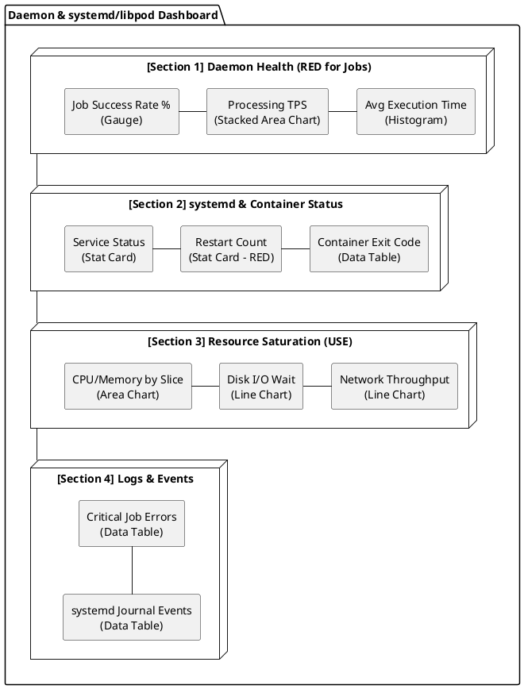

# 데몬 및 systemd/libpod 환경의 대시보드 구성 가이드

본 문서는 웹 애플리케이션 외에 백그라운드에서 동작하는 데몬(Daemon) 애플리케이션과, 이를 `systemd` 또는 `libpod(Podman)`를 통해 관리할 때 필요한 특화된 관측성 대시보드 구성 방안을 정의한다.

---

## 1. 데몬 앱의 RED Metrics 재정의 (Job/Task 중심)

데몬 앱은 HTTP 요청 대신 메시지 큐, 배치 작업, 스케줄링 등을 처리하므로 기존 웹 앱의 RED 지표를 다음과 같이 재정의하여 적용한다.

| 지표 (RED)   | 웹 앱 (HTTP)       | 데몬 앱 (Daemon/Job)       | OTel Metric 예시 (Custom/Standard)      |
| :----------- | :----------------- | :------------------------- | :-------------------------------------- |
| **Rate**     | Request Per Second | **Job/Task Per Second**    | `job.processed.count`, `messages.total` |
| **Error**    | HTTP 5xx Rate      | **Task Failure Rate**      | `job.failed.count`, `process.errors`    |
| **Duration** | HTTP Latency       | **Execution/Process Time** | `job.duration.seconds`, `task.latency`  |

### 시각화 전략

- **Processing Rate:** `Stacked Area Chart`를 사용하여 성공한 작업과 실패한 작업을 실시간으로 누적 표시.
- **Queue Depth (Saturation):** 처리 대기 중인 메시지나 작업 수를 `Line Chart`로 표시하여 병목 현상 감지.

---

## 2. systemd 서비스 관측성 (Native Process)

RPM으로 설치되어 `systemd`로 관리되는 서비스의 상태를 대시보드에 포함한다.

- **Service Health Status:** `Gauge` 위젯을 사용하여 서비스의 `Active/Inactive` 상태를 시각화.
- **Restart Count:** `Stat` 위젯으로 최근 1시간 내 서비스 재시작 횟수를 표시. (갑작스러운 Crash 감지)
- **Systemd Journal Logs:** `Data Table` 위젯에서 `systemd.unit: "my-service.service"` 필터로 필터링된 시스템 로그를 노출.

---

## 3. libpod(Podman) & systemd 관리 컨테이너

`systemd` 유닛 내에서 `podman` 컨테이너로 실행되는 경우, 호스트와 컨테이너 경계의 메트릭을 함께 확인해야 한다.

- **Container Resource vs Host Limit:** 컨테이너가 사용하는 CPU/Memory가 `systemd` slice에 할당된 제한치에 근접하는지 `Gauge` 또는 `Bullet Graph`로 표시.
- **Container Lifecycle:** 컨테이너의 `Exit Code`와 `State`를 `Table`로 관리하여 비정상 종료 이력 추적.

---

## 4. 데몬 상세 대시보드 레이아웃 (Layout Design)



### ASCII 레이아웃 (Conceptual View)

```text
+-----------------------------------------------------------------------+
| [Filter] service.name: [batch-processor v]  host: [prod-worker-01 v]  |
+-----------------------------------------------------------------------+
| <Section 1: Daemon Health (RED for Jobs)>                             |
| [ Job Success Rate % ] [ Processing TPS ] [ Avg Execution Time ]      |
+-----------------------------------------------------------------------+
| <Section 2: systemd & Container Status>                               |
| [ Service Status (Stat) ] [ Restart Count ] [ Container Exit Code ]   |
+-----------------------------------------------------------------------+
| <Section 3: Resource Saturation (USE)>                                |
| [ CPU/Memory by Slice ] [ Disk I/O Wait ] [ Network Throughput ]      |
+-----------------------------------------------------------------------+
| <Section 4: Logs & Events>                                            |
| [ Critical Job Errors (Table) ] [ systemd Journal Events (Table) ]    |
+-----------------------------------------------------------------------+
```

---

## 5. 관리 포인트: 통합 운영 전략

- **변수 활용:** `systemd.unit_name` 또는 `container.name` 변수를 대시보드 상단에 배치하여, 여러 대시보드를 만들지 않고 하나의 템플릿으로 모든 데몬을 관리한다.
- **Drill-down:** `Global Overview`에서 특정 서버의 부하를 발견하면, 해당 서버의 `systemd` 서비스 상세 대시보드로 이동할 수 있도록 링크를 구성한다.

관련 문서:

- [대시보드 통합 운영 전략](./dashboard-strategy-guide.md)
- [애플리케이션 상세 대시보드 구현 가이드](./app-detailed-dashboard-implementation.md)
