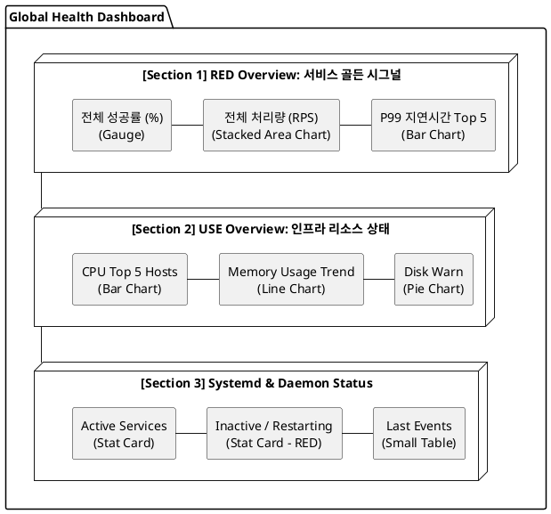
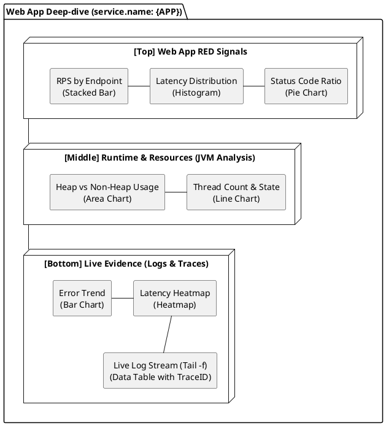
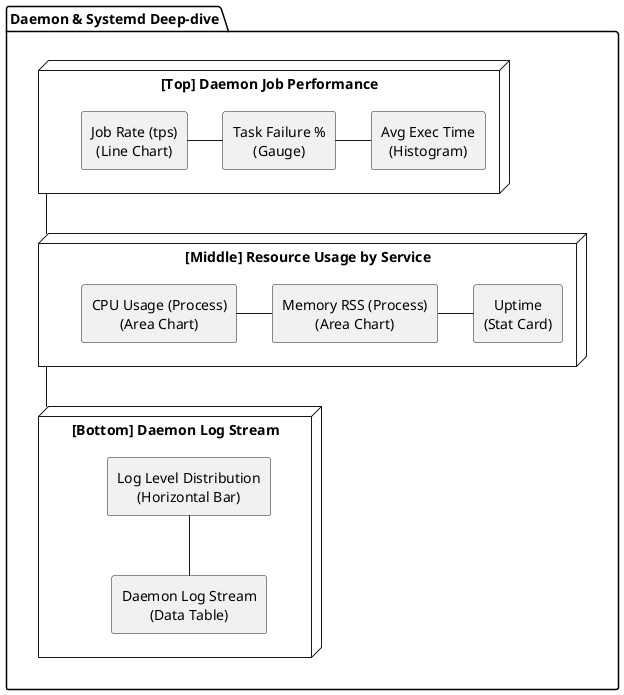

# 관측성 대시보드 구성 청사진 (Dashboard Composition Blueprint)

본 문서는 OTLP 기반의 Logs, Traces, Metrics를 활용하여 구체적으로 어떤 위젯을 어디에 배치하고, 어떤 시각화 방식을 사용할지 정의하는 '대시보드 구성 마스터 플랜'이다.

---

## 1. 전역 현황 (Global Health) 대시보드

**목적:** 전체 시스템의 건강 상태를 한눈에 파악하고 이상 징후를 감지.

| 섹션             | 위젯 명칭               | 데이터 소스                  | 시각화 타입        | 기간/갱신 |
| :--------------- | :---------------------- | :--------------------------- | :----------------- | :-------- |
| **RED Overview** | 전체 서비스 성공률      | `http.server.duration_count` | **Gauge** (0-100%) | 15m / 30s |
|                  | 전체 RPS 추이           | `http.server.duration_count` | **Stacked Area**   | 30m / 30s |
|                  | P99 지연시간 Top 5      | `http.server.duration`       | **Horizontal Bar** | 1h / 1m   |
| **USE Overview** | CPU 사용량 Top 5 호스트 | `system.cpu.utilization`     | **Bar Chart**      | 1h / 1m   |
|                  | 메모리 사용량 (전체)    | `system.memory.usage`        | **Line Chart**     | 1h / 1m   |
|                  | 디스크 잔여량 경고      | `system.disk.utilization`    | **Pie Chart**      | 24h / 5m  |
| **Status**       | 서비스 상태 요약        | `systemd.unit.state`         | **Stat (Count)**   | 15m / 30s |

### 전역 현황 레이아웃 (Layout Design)



### ASCII 레이아웃 (Conceptual View)

```text
+-----------------------------------------------------------------------+
| [Section 1] RED Overview: 서비스 골든 시그널                             |
| +-----------------+ +-------------------------+ +-------------------+ |
| | 전체 성공률 (%)  | | 전체 처리량 (RPS)       | | P99 지연시간 Top 5| |
| | (Gauge)         | | (Stacked Area Chart)    | | (Bar Chart)       | |
| +-----------------+ +-------------------------+ +-------------------+ |
+-----------------------------------------------------------------------+
| [Section 2] USE Overview: 인프라 리소스 상태                             |
| +-------------------------+ +-------------------------+ +-----------+ |
| | CPU Top 5 Hosts         | | Memory Usage Trend      | | Disk Warn | |
| | (Bar Chart)             | | (Line Chart)            | | (Pie)     | |
| +-------------------------+ +-------------------------+ +-----------+ |
+-----------------------------------------------------------------------+
| [Section 3] Systemd & Daemon Status                                   |
| +-----------------+ +-------------------------+ +-------------------+ |
| | Active Services | | Inactive / Restarting   | | Last Events       | |
| | (Stat Card)     | | (Stat Card - RED)       | | (Small Table)     | |
| +-----------------+ +-------------------------+ +-------------------+ |
+-----------------------------------------------------------------------+
```

---

**목적:** 특정 서비스의 성능 저하 원인 분석 및 실시간 장애 대응.

| 섹션            | 위젯 명칭             | 데이터 소스                  | 시각화 타입     | 기간/갱신 |
| :-------------- | :-------------------- | :--------------------------- | :-------------- | :-------- |
| **Service RED** | 엔드포인트별 RPS      | `http.server.duration_count` | **Stacked Bar** | 15m / 10s |
|                 | 응답 시간 분포        | `http.server.duration`       | **Histogram**   | 1h / 30s  |
|                 | HTTP 상태 코드 비중   | `http.server.duration_count` | **Pie Chart**   | 15m / 30s |
| **Runtime**     | JVM Heap & GC         | `jvm.memory.used`, `gc`      | **Line & Area** | 1h / 1m   |
|                 | Active Threads        | `jvm.thread.count`           | **Line Chart**  | 1h / 1m   |
| **Log/Trace**   | 에러 로그 발생 트렌드 | `logs-otel-v1`               | **Bar Chart**   | 1h / 30s  |
|                 | 실시간 로그 스트림    | `logs-otel-v1`               | **Data Table**  | 15m / 5s  |
|                 | 지연 시간 히트맵      | Traces (Span Duration)       | **Heatmap**     | 1h / 30s  |

### 웹 앱 상세 레이아웃 (Layout Design)



### ASCII 레이아웃 (Conceptual View)

```text
+-----------------------------------------------------------------------+
| [Top] Web App RED Signals (service.name: {APP})                       |
| +-----------------+ +-------------------------+ +-------------------+ |
| | RPS by Endpoint | | Latency Distribution    | | Status Code Ratio | |
| | (Stacked Bar)   | | (Histogram)             | | (Pie Chart)       | |
| +-----------------+ +-------------------------+ +-------------------+ |
+-----------------------------------------------------------------------+
| [Middle] Runtime & Resources (JVM Analysis)                           |
| +-------------------------------------+ +---------------------------+ |
| | Heap vs Non-Heap Usage              | | Thread Count & State      | |
| | (Area Chart)                        | | (Line Chart)              | |
| +-------------------------------------+ +---------------------------+ |
+-----------------------------------------------------------------------+
| [Bottom] Live Evidence (Logs & Traces)                                |
| +-------------------------+ +---------------------------------------+ |
| | Error Trend (Bar)       | | Latency Heatmap (Visual Analysis)     | |
| +-------------------------+ +---------------------------------------+ |
| +-------------------------------------------------------------------+ |
| | TIMESTAMP | LEVEL | MESSAGE | TRACE_ID (Link)                     | |
| | (Live Data Table - Auto Refresh 5s - "Tail -f" Experience)        | |
| +-------------------------------------------------------------------+ |
+-----------------------------------------------------------------------+
```

---

## 3. 데몬/시스템 상세 (Daemon & Systemd Deep-dive)

**목적:** 백그라운드 작업 및 시스템 서비스의 안정성 감시.

| 섹션           | 위젯 명칭             | 데이터 소스                | 시각화 타입        | 기간/갱신 |
| :------------- | :-------------------- | :------------------------- | :----------------- | :-------- |
| **Job Signal** | 작업 처리 속도 (Rate) | Custom Metric / Log Count  | **Line Chart**     | 1h / 1m   |
|                | 작업 실패율           | Log Error / Span Error     | **Gauge**          | 15m / 30s |
|                | 평균 실행 시간        | Span Duration              | **Histogram**      | 1h / 1m   |
| **Systemd**    | CPU/Memory (Service)  | `systemd.service.resource` | **Area Chart**     | 1h / 1m   |
|                | 서비스 업타임         | `systemd.unit.uptime`      | **Stat (Time)**    | 24h / 5m  |
| **Logs**       | 로그 레벨 분포        | `logs-otel-v1`             | **Horizontal Bar** | 15m / 30s |
|                | 실시간 데몬 로그      | `logs-otel-v1`             | **Data Table**     | 15m / 5s  |

### 데몬 상세 레이아웃 (Layout Design)



### ASCII 레이아웃 (Conceptual View)

```text
+-----------------------------------------------------------------------+
| [Top] Daemon Job Performance                                          |
| +-----------------+ +-------------------------+ +-------------------+ |
| | Job Rate (tps)  | | Task Failure %          | | Avg Exec Time     | |
| | (Line Chart)    | | (Gauge)                 | | (Histogram)       | |
| +-----------------+ +-------------------------+ +-------------------+ |
+-----------------------------------------------------------------------+
| [Middle] Resource Usage by Service                                    |
| +-------------------------+ +-------------------------+ +-----------+ |
| | CPU Usage (Process)     | | Memory RSS (Process)    | | Uptime    | |
| | (Area Chart)            | | (Area Chart)            | | (Stat)    | |
| +-------------------------+ +-------------------------+ +-----------+ |
+-----------------------------------------------------------------------+
| [Bottom] Daemon Log Stream                                            |
| +-------------------------------------------------------------------+ |
| | Log Level Distribution (Horizontal Bar)                           | |
| +-------------------------------------------------------------------+ |
| | TIMESTAMP | LEVEL | MESSAGE (Log Content)                         | |
| | (Data Table - Auto Refresh 5s)                                    | |
| +-------------------------------------------------------------------+ |
+-----------------------------------------------------------------------+
```

---

## 4. 핵심 시각화 가이드 (Visualization Guide)

1. **Gauge (게이지):** '현재' 가장 위험한 수치를 보여줄 때 사용 (예: 성공률 90% 미만 시 빨간색).
2. **Stacked Area/Bar (스택형):** '전체' 대비 '부분'의 비중을 시간 흐름으로 볼 때 사용 (예: 전체 요청 중 에러 비중).
3. **Histogram (히스토그램):** 응답 시간의 '분포'를 파악하여 소수의 느린 요청(Long-tail)을 감지할 때 사용.
4. **Heatmap (히트맵):** 수천 개의 트레이스 데이터를 시간과 레이턴시 축으로 시각화하여 패턴을 찾을 때 사용.
5. **Data Table (데이터 테이블):** 원시 로그를 최신순으로 정렬하여 장애의 직접적인 증거(Evidence)를 확인할 때 사용.
