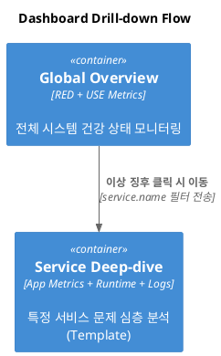

# 관측성 대시보드 전략: 최소한의 관리로 최대의 가시성 확보하기

대시보드가 많아지면 관리가 힘들어지고 정보가 분산됩니다. 본 문서는 'Global Overview'와 'Service Deep-dive'라는 **단 두 개의 핵심 대시보드 템플릿**만 운영하여 관리 효율성을 극대화하는 전략을 제안합니다.

---

## 1. 대시보드 계층 구조 (Dashboard Hierarchy)

전체 시스템 상태에서 특정 서비스의 문제까지 'Drill-down' 방식으로 접근합니다.

1.  **[Global] 전체 서비스 현황 (Overview):** 모든 마이크로서비스 및 데몬의 RED 지표와 인프라 USE 지표를 한눈에 파악.
2.  **[Service] 개별 서비스 상세 (Deep-dive):** 특정 서비스(Web/Daemon)의 런타임과 실시간 로그 스트림을 분석. (**템플릿 1개로 전 서비스 대응**)

---

## 2. 대시보드 진화 로드맵 (Evolution Roadmap)

관리 효율성을 위해 초기에는 언어 중립적인 SRE 지표(RED Metrics)에 집중하고, 특정 언어(JVM, Go 등)에 종속적인 메트릭은 필요에 따라 단계적으로 추가하는 전략을 취합니다.

| 단계        | 목표                 | 주요 지표 (Metrics)                       | 비고                             |
| :---------- | :------------------- | :---------------------------------------- | :------------------------------- |
| **Phase 1** | **범용 SRE 지표**    | HTTP RPS, 에러율, P99 Latency, Job 성공률 | 언어와 무관하게 즉시 적용 가능   |
| **Phase 2** | **런타임 심층 분석** | JVM Heap/GC, Thread State, Go Goroutine   | 특정 언어/환경 이슈 분석 시 추가 |
| **Phase 3** | **비즈니스 커스텀**  | 주문 처리량, 결제 성공률 등 비즈니스 KPI  | 서비스별 커스텀 속성 기반        |



---

## 2. 관리 포인트 최소화 전략

### ① 변수(Variables) 및 필터 적극 활용

여러 대시보드를 만들지 않고, 상단의 **Control Widget (Dropdown)**을 통해 데이터를 전환합니다.

- `service.name`: 특정 서비스를 선택하여 대시보드 전체 내용을 해당 서비스 데이터로 즉시 변경.
- `host.name`: 특정 서버 노드별 인프라 지표 필터링.

### ② 드릴다운(Drill-down) 링크 설정

OpenSearch Dashboards의 'Panel Link' 기능을 활용합니다.

- Global 대시보드의 'Top 5 Error Services' 위젯에서 특정 서비스 이름을 클릭하면, 해당 서비스 필터가 적용된 Service Deep-dive 대시보드로 자동 이동하도록 설정합니다.

---

## 3. 대시보드 세부 구성

### [Template 1] Global Overview (전역 현황)

전체 시스템의 골든 시그널을 확인합니다.

| 섹션             | 위젯 예시                                   | 시각화           | 비고                            |
| :--------------- | :------------------------------------------ | :--------------- | :------------------------------ |
| **RED Overview** | 전역 성공률, 전체 TPS, P99 지연시간 상위 앱 | Gauge, Area, Bar | 시스템 전체 부하 및 에러 감지   |
| **USE Overview** | CPU/MEM 사용률 상위 호스트, 디스크 가용량   | Bar, Metric Card | 리소스 병목 지점 확인           |
| **Systemd Sync** | 서비스 상태 요약 (Active/Restarting)        | Stat, Pie        | 데몬 및 시스템 서비스 이상 감지 |

### [Template 2] Service Deep-dive (서비스 상세)

특정 앱의 내부 상태와 로그를 실시간으로 확인합니다. (`service.name` 필터 필수)

| 섹션           | 위젯 예시                                      | 시각화       | 비고                             |
| :------------- | :--------------------------------------------- | :----------- | :------------------------------- |
| **App Signal** | 해당 앱의 엔드포인트별 Latency, HTTP 상태 코드 | Heatmap, Bar | 특정 API 문제 식별               |
| **Runtime**    | JVM Heap Usage, Thread Count, GC               | Line         | 런타임 메모리 누수 등 확인       |
| **Log Stream** | 실시간 로그 테이블 (tail -f 형태)              | Data Table   | 장애 로그 실시간 추적 (5초 갱신) |

---

## 4. 시각적 레이아웃 통합 설계

```text
+-----------------------------------------------------------------------+
| [Shared] Dashboard Filter: [ service.name v ] [ time_range v ]         |
+-----------------------------------------------------------------------+
| 1. Golden Signals (RED)                                               |
| +-----------------+ +-------------------------+ +-------------------+ |
| | Availability %  | | Throughput (RPS)        | | Top Latency APIs  | |
| +-----------------+ +-------------------------+ +-------------------+ |
+-----------------------------------------------------------------------+
| 2. Analysis & Logs                                                    |
| +-------------------------------------+ +---------------------------+ |
| | Resource Usage (CPU/MEM)            | | Log Level Distribution    | |
| +-------------------------------------+ +---------------------------+ |
| +-------------------------------------------------------------------+ |
| | Live Log Stream (Recent Logs with TraceID)                        | |
| +-------------------------------------------------------------------+ |
+-----------------------------------------------------------------------+
```

---

## 5. 결론: 왜 이 방식인가?

1.  **유지보수 용이:** 대시보드 레이아웃을 수정할 때 두 개의 파일만 관리하면 됩니다.
2.  **학습 곡선 완화:** 운영자가 이동해야 할 경로가 단순하여 장애 대응 속도가 빨라집니다.
3.  **데이터 일관성:** 동일한 필터 체계를 공유하므로 '여기서 보는 수치'와 '저기서 보는 수치'가 달라지는 혼선을 방지합니다.

관련 상세 가이드:

- [RED/USE 지표 상세 정의](./meaningful-dashboard-guide.md)
- [로그 스트림 및 상세 위젯 구성](./app-specific-dashboard-guide.md)
- [데몬 및 systemd 환경 가이드](./daemon-systemd-dashboard-guide.md)
- [애플리케이션 대시보드 구체적 구현 가이드](./app-detailed-dashboard-implementation.md)
