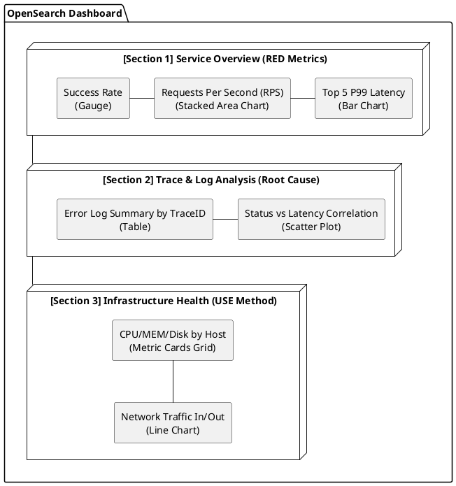

# 유의미한 대시보드 구성을 위한 가이드 (RED Metrics & USE Method)

본 문서는 OTLP 기반의 계측 데이터(Logs, Traces, Metrics)를 활용하여 실무에서 즉각적으로 장애를 인지하고 분석할 수 있는 '유의미한' 대시보드를 기획하고 구성하는 방법을 정의한다.

## 1. 대시보드 설계 원칙

- **Top-Down 구조:** 가장 중요한 서비스 지표(RED)를 상단에, 원인 분석을 위한 인프라 지표(USE)를 하단에 배치한다.
- **실행 가능성(Actionable):** 수치가 특정 임계치를 넘었을 때 운영자가 무엇을 해야 할지 명확해야 한다.
- **일관된 시간축:** 모든 위젯은 동일한 시간 범위를 공유하여 상관관계 분석이 가능해야 한다.
- **애플리케이션 상세 연계:** 전역 지표에서 이상 탐지 시, [애플리케이션 중심 대시보드](app-specific-dashboard-guide.md)로 이동하여 상세 원인을 파악한다.

---

## 2. 서비스 관점: RED Metrics 대시보드

애플리케이션의 건강 상태를 측정하며, 사용자 경험에 직접적인 영향을 주는 지표이다.

| 지표 (Metric)            | 설명                          | 권장 시각화 (Visualization)                  | 시간 범위 및 버킷        |
| :----------------------- | :---------------------------- | :------------------------------------------- | :----------------------- |
| **R**ate (요청률)        | 초당 요청 수 (TPS/RPS)        | **Area Chart / Line Chart** (성공/실패 스택) | 최근 15~30분 (10s 버킷)  |
| **E**rrors (에러율)      | HTTP 5xx, Exception 발생 빈도 | **Gauge / Heatmap** (현재 에러율 %)          | 최근 15분 (실시간 감시)  |
| **D**uration (지연 시간) | 응답 시간 (P95, P99 Latency)  | **Histogram / Line Chart** (Percentiles)     | 최근 1시간 (트렌드 분석) |

### 상세 구성 계획

- **R (Rate):** `Line Chart` 또는 `Stacked Area Chart`를 사용하여 전체 요청수를 표시하고, `Status Code`별로 쪼개어 보여준다. (2xx는 초록, 5xx는 빨강)
- **E (Errors):** `Pie Chart`를 통해 전체 에러 중 특정 서비스나 API가 차지하는 비중을 보여준다. `Gauge`는 현재 실시간 성공률을 0~100%로 표시하는 데 사용한다.
- **D (Duration):** `Heatmap`을 사용하여 시간대별 요청 분포를 시각화하거나, `Line Chart`로 P95, P99 백분위수를 표시한다.

---

## 3. 리소스 관점: USE Method 대시보드

시스템 자원의 병목 현상을 진단하기 위한 지표이다.

| 지표 (Metric)            | 설명                                   | 권장 시각화 (Visualization)    | 시간 범위 및 버킷       |
| :----------------------- | :------------------------------------- | :----------------------------- | :---------------------- |
| **U**tilization (사용률) | 자원 사용 정도 (CPU, Memory %)         | **Gauge (현재) / Line (추이)** | 최근 1시간 (5m 버킷)    |
| **S**aturation (포화도)  | 대기열 발생 (Thread Pool, I/O Wait)    | **Bar Chart (Ranking)**        | 최근 15분 (임계치 감시) |
| **E**rrors (에러)        | 시스템 레벨 에러 (Net Drop, Disk Fail) | **Stat (Count) / Table**       | 최근 24시간 (누적)      |

### 상세 구성 계획

- **U (Utilization):** `Gauge` 위젯을 사용하여 현재 CPU/메모리 사용률이 80%를 넘는지 시각적으로 경고(Red 색상)한다.
- **S (Saturation):** `Horizontal Bar Chart`를 사용하여 가장 포화도가 높은 서버 노드 TOP 5를 나열한다.
- **E (Errors):** `Stat` 위젯으로 최근 1시간 내 발생한 시스템 에러 개수를 큼직하게 표시한다. 0이 아닐 경우 즉시 점검이 필요하다.

---

## 4. OpenSearch Dashboards 화면 레이아웃 계획

대시보드 한 페이지에서 위에서 아래로 흐르는 시나리오를 설계한다.

### 시각적 레이아웃 (Layout Design)



### ASCII 레이아웃 (Conceptual View)

```text
+-----------------------------------------------------------------------+
| [Section 1] Service Overview (RED Metrics)                            |
| +-----------------+ +-------------------------+ +-------------------+ |
| | Success Rate %  | | Throughput (RPS)        | | Top 5 Latency     | |
| | (Gauge)         | | (Stacked Area Chart)    | | (Bar Chart)       | |
| +-----------------+ +-------------------------+ +-------------------+ |
+-----------------------------------------------------------------------+
| [Section 2] Trace & Log Analysis (Root Cause)                         |
| +-------------------------------------+ +---------------------------+ |
| | Error Log Summary by TraceID        | | Status vs Latency         | |
| | (Table)                             | | (Scatter Plot)            | |
| +-------------------------------------+ +---------------------------+ |
+-----------------------------------------------------------------------+
| [Section 3] Infrastructure Health (USE Method)                        |
| +-------------------------------------------------------------------+ |
| | Host Metrics: CPU / MEM / Disk Usage (Metric Cards Grid)          | |
| +-------------------------------------------------------------------+ |
| | Network Traffic In/Out (Line Chart)                                | |
| +-------------------------------------------------------------------+ |
+-----------------------------------------------------------------------+
```

### 상세 구성 요소

---

## 5. 기간 및 갱신 주기 가이드

- **운영 실시간 모니터링 (Live):**
    - 조회 기간: 최근 15분
    - 자동 갱신: 10초 ~ 30초
    - 용도: 현재 발생한 장애 즉시 인지
- **데일리 리포트 (Daily):**
    - 조회 기간: 최근 24시간
    - 용도: 일일 트래픽 패턴 확인 및 이상 징후(Anomaly) 탐지
- **용량 계획 (Long-term):**
    - 조회 기간: 최근 7일 ~ 30일
    - 용도: 리소스 증설 필요성 판단 (Capacity Planning)
