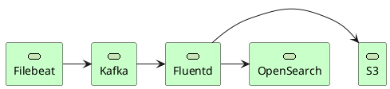

# 일 41TB, 200억 건의 로그를 ClickStack으로 실시간 처리하기 - 호그와트 도서관 프로젝트 리뷰

https://tech.kakaopay.com/post/pallas-v2-log-platform

## 시작하며

> "로그 조회가 너무 느려요. 5분 넘게 걸릴 때도 있어요." > "장애 분석하려는데 로그가 아직 안들어왔어요."

로그를 조회하는 경우는 언제일까? 특정 오류가 발생하였을 때 어떠한 로그가 발생하였는지 확인할 때다.

알림에 대해서 바로 로그에 대응되는 traceId, spanId를 바로 알림을 받을 수 있도록 하면 되지 않을까?

## 기존 아키텍처의 한계



### 문제점

1. 비용: OpenSearch 비용
2. 성능: Fluentd의 청크 처리 방식으로 메모리 사용량 증가 및 처리 지연
3. 확장성: 서비스 단위 Topic 분리로 Kafka Topic이 300개 이상으로 증가
4. 장기 조회:

## Step 1. 수집기 전환: Filebeat -> OTel Instrumentation

App (OTel Instrumentation) → OTLP → OTel Collector → Kafka

### Protobuf

`protobuf` (`{'Content-Type': 'application/x-protobuf'}`)로 지원하지 않는다.

다만, 비교 대상인 `Fluentbit`은 지원한다. ([공식문서](https://docs.fluentbit.io/manual/data-pipeline/inputs/opentelemetry#get-started))

블로그의 개시된 환경에서는 FileBeat의 전송 효율을 떨어지는 것은 사실이다.

### 배치전송

```text
Filebeat: 로그 1건 = Kafka 메시지 1개  →  1,000건 = 1,000개 메시지
OpenTelemetry:     로그 N건 = Kafka 메시지 1개  →  1,000건 = ~1개 메시지 (batch size 기준)
```

```text
ExportLogsServiceRequest
  └── ResourceLogs[]          ← Resource(host, service 등)로 그룹화
        └── ScopeLogs[]       ← 계측 라이브러리(scope)로 그룹화
              └── LogRecord[] ← 실제 로그
```

더불어 여기 블로그에서 말하는 배치는 OTEL Collector 를 지칭한다.

```yaml
receivers:
    otlp:
        protocols:
            grpc:
                endpoint: 0.0.0.0:4317

processors:
    batch:
        send_batch_size: 2000
        timeout: 1s

exporters:
    kafka:
        brokers: [localhost:9092]
        topic: my-log-topic
        protocol_version: 2.1.0

service:
    pipelines:
        logs:
            receivers: [otlp]
            processors: [batch]
            exporters: [kafka]
```

| 로그 타입   | 목적                                | 활용                                   |
| ----------- | ----------------------------------- | -------------------------------------- |
| std         | 애플리케이션 표준 로그              | 장애 분석, 디버깅, 성능 모니터링       |
| nginx       | 웹 서버 접근 로그                   | 트래픽 분석, 보안 감사, 접근 이력 추적 |
| transaction | 애플리케이션 request, response 로그 | 트랜잭션 흐름 추적                     |
