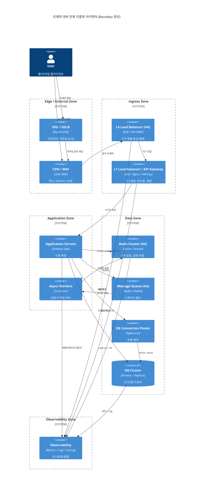
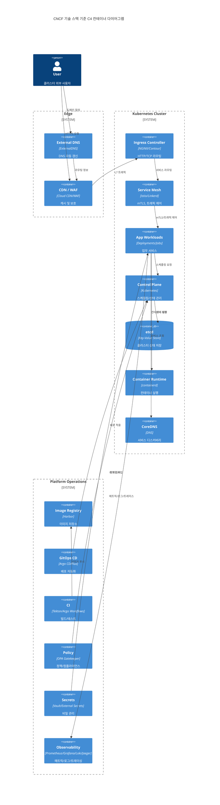
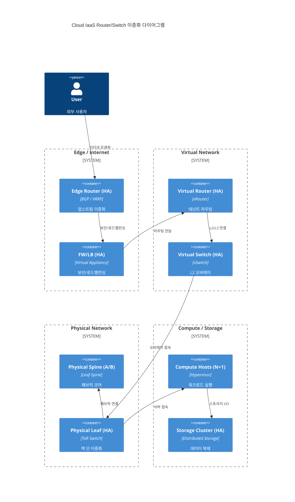

# 이중화

## 애플리케이션 계층

```mermaid
C4Container
    title 트래픽 대비 전체 이중화 아키텍처 (Boundary 정리)
    Person(user, "User", "웹/모바일 클라이언트")

    System_Boundary(edge, "Edge / External Zone") {
        Container(dns, "DNS / GSLB", "Route53/NS", "리전/IDC 라우팅 (A/A)")
        Container(cdn, "CDN / WAF", "CDN+WAF", "캐시, DDoS/L7 보호")
    }

    System_Boundary(ingress, "Ingress Zone") {
        Container(l4, "L4 Load Balancer (HA)", "NLB / VIP+VRRP", "TCP 레벨 분산/절체")
        Container(l7, "L7 Load Balancer / API Gateway", "ALB / Nginx / HAProxy", "TLS 종료, 라우팅, 제한")
    }

    System_Boundary(appzone, "Application Zone") {
        Container(app, "Application Servers", "Stateless App", "수평 확장")
        Container(worker, "Async Workers", "Consumer", "비동기 작업 처리")
    }

    System_Boundary(data, "Data Zone") {
        Container(cache, "Redis Cluster (HA)", "Cache / Session", "DB 보호, 상태 저장")
        Container(mq, "Message Queue (HA)", "Kafka / Rabbit", "스파이크 흡수")
        Container(pool, "DB Connection Pooler", "PgBouncer", "연결 제어")
        ContainerDb(db, "DB Cluster", "Primary + Replicas", "쓰기/읽기 분리")
    }

    System_Boundary(obs, "Observability Zone") {
        Container(obsrv, "Observability", "Metrics / Logs / Tracing", "모니터링/알람")
    }

    Rel(user, dns, "도메인 질의")
    Rel(user, cdn, "HTTPS 요청")
    Rel(dns, cdn, "라우팅 정보 제공")
    Rel(cdn, l4, "동적 트래픽")
    Rel(l4, l7, "TCP 전달")
    Rel(l7, app, "HTTP 요청")
    Rel(app, cache, "Cache-aside / Session")
    Rel(app, mq, "이벤트 발행")
    Rel(mq, worker, "메시지 전달")
    Rel(worker, cache, "락/캐시")
    Rel(app, pool, "DB 연결")
    Rel(pool, db, "Write / Read")
    Rel(app, db, "Read (Replica)")
    Rel(l4, obsrv, "메트릭")
    Rel(l7, obsrv, "접근 로그")
    Rel(app, obsrv, "애플리케이션 메트릭")
    Rel(cache, obsrv, "Latency / Hit")
    Rel(db, obsrv, "QPS / Lag")
```

### Kubernetes (CNCF)

```mermaid
C4Container
    title CNCF 기술 스택 기준 C4 컨테이너 다이어그램
    Person(user, "User", "클러스터 외부 사용자")
    System_Boundary(edge, "Edge") {
        Container(dns, "External DNS", "ExternalDNS", "DNS 자동 갱신")
        Container(cdn, "CDN / WAF", "Cloud CDN/WAF", "캐시 및 보호")
    }

    System_Boundary(cluster, "Kubernetes Cluster") {
        Container(ingress, "Ingress Controller", "NGINX/Contour", "HTTP/TCP 라우팅")
        Container(mesh, "Service Mesh", "Istio/Linkerd", "mTLS, 트래픽 제어")
        Container(app, "App Workloads", "Deployments/Jobs", "업무 서비스")

        Container(k8s, "Control Plane", "Kubernetes", "스케줄링/상태 관리")
        ContainerDb(etcd, "etcd", "Key-Value Store", "클러스터 상태 저장")
        Container(cri, "Container Runtime", "containerd", "컨테이너 실행")
        Container(coredns, "CoreDNS", "DNS", "서비스 디스커버리")
    }

    System_Boundary(ops, "Platform Operations") {
        Container(registry, "Image Registry", "Harbor", "이미지 저장소")
        Container(gitops, "GitOps CD", "Argo CD/Flux", "배포 자동화")
        Container(ci, "CI", "Tekton/Argo Workflows", "빌드/테스트")
        Container(policy, "Policy", "OPA Gatekeeper", "정책/컴플라이언스")
        Container(secrets, "Secrets", "Vault/External Secrets", "비밀 관리")
        Container(obs, "Observability", "Prometheus/Grafana/Loki/Jaeger", "메트릭/로그/트레이싱")
    }

    Rel(user, dns, "도메인 질의")
    Rel(user, cdn, "HTTPS 요청")
    Rel(dns, cdn, "라우팅 정보")
    Rel(cdn, ingress, "L7 트래픽")
    Rel(ingress, mesh, "서비스 라우팅")
    Rel(mesh, app, "mTLS/트래픽 제어")
    Rel(app, k8s, "스케줄링 요청")
    Rel(k8s, etcd, "상태 저장")
    Rel(app, cri, "컨테이너 실행")
    Rel(app, coredns, "서비스 조회")
    Rel(app, obs, "메트릭/로그/트레이스")
    Rel(ci, registry, "이미지 푸시")
    Rel(gitops, k8s, "배포 적용")
    Rel(policy, k8s, "정책 검사")
    Rel(secrets, app, "시크릿 주입")
```

### Cloud IaaS

```mermaid
C4Container
    title Cloud IaaS Router/Switch 이중화 다이어그램
    Person(user, "User", "외부 사용자")

    System_Boundary(edge, "Edge / Internet") {
        Container(bgp, "Edge Router (HA)", "BGP / VRRP", "업스트림 이중화")
        Container(fw, "FW/LB (HA)", "Virtual Appliance", "보안/로드밸런싱")
    }

    System_Boundary(overlay, "Virtual Network") {
        Container(vrouter, "Virtual Router (HA)", "vRouter", "테넌트 라우팅")
        Container(vswitch, "Virtual Switch (HA)", "vSwitch", "L2 오버레이")
    }

    System_Boundary(underlay, "Physical Network") {
        Container(pspine, "Physical Spine (A/B)", "Leaf-Spine", "패브릭 코어")
        Container(pleaf, "Physical Leaf (HA)", "ToR Switch", "랙 단 이중화")
    }

    System_Boundary(compute, "Compute / Storage") {
        Container(host, "Compute Hosts (N+1)", "Hypervisor", "워크로드 실행")
        Container(storage, "Storage Cluster (HA)", "Distributed Storage", "데이터 복제")
    }

    Rel(user, bgp, "인터넷 트래픽")
    Rel(bgp, fw, "보안/로드밸런싱")
    Rel(fw, vrouter, "라우팅 전달")
    Rel(vrouter, vswitch, "L2/L3 연결")
    Rel(vswitch, pleaf, "오버레이 접속")
    Rel(pleaf, pspine, "패브릭 연결")
    Rel(pleaf, host, "서버 접속")
    Rel(host, storage, "스토리지 I/O")
```
